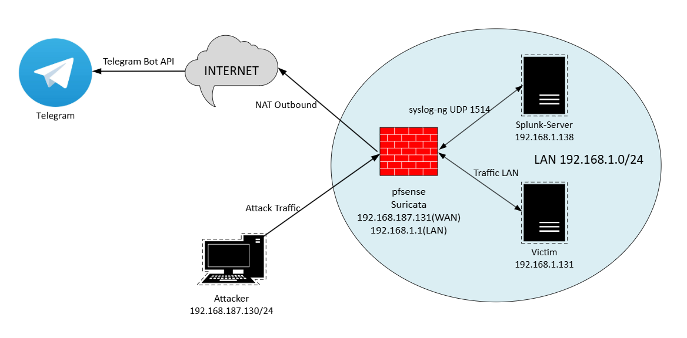
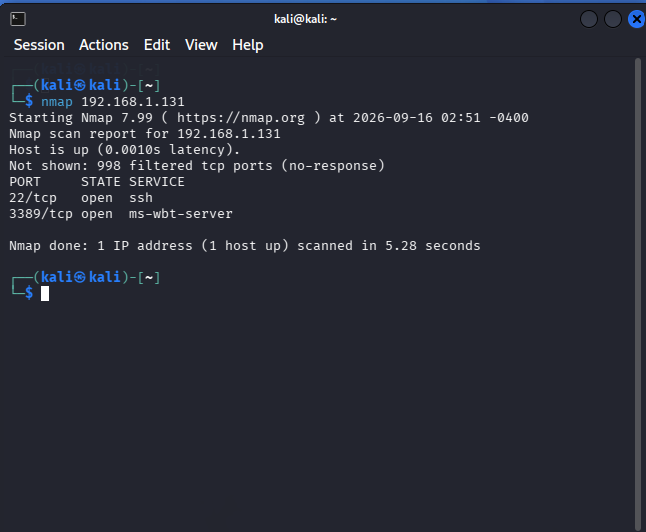
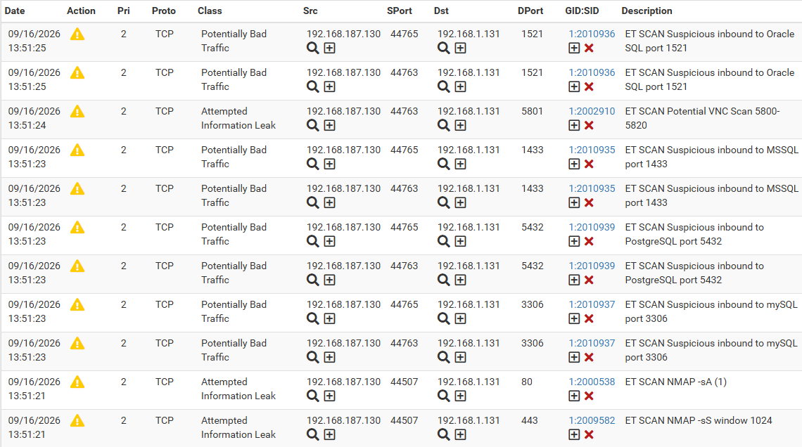
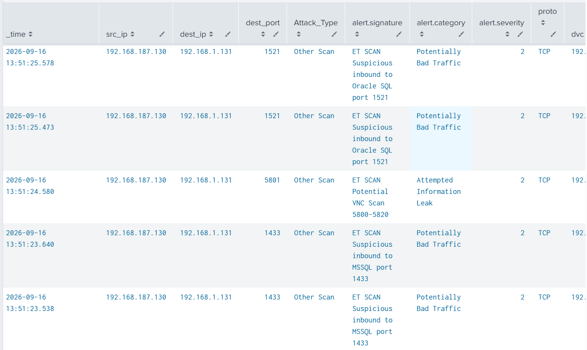
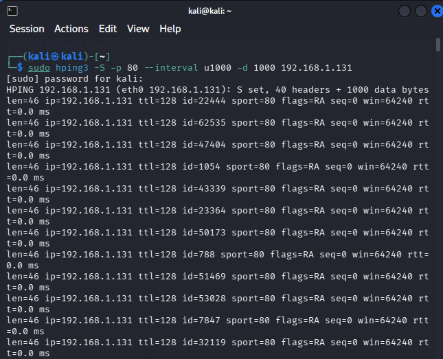

# 🛡️ pfSense-Suricata-Splunk Integration Lab

[](LICENSE)
[](https://github.com/klopkk74/pfSense-Suricata-Splunk-Integration-Lab)
[](https://www.splunk.com/)
[](https://www.python.org/)
[](https://www.pfsense.org/)
[](https://suricata.io/)

## 📌 Tổng quan

**pfSense-Suricata-Splunk Integration Lab** là một dự án xây dựng hệ thống giám sát an ninh mạng tập trung (SOC Lab – Security Operations Center Laboratory), mô phỏng môi trường vận hành bảo mật thực tế. Hệ thống tích hợp các công cụ mã nguồn mở và phần mềm miễn phí để **phát hiện, thu thập, phân tích và cảnh báo** các cuộc tấn công mạng phổ biến.

### 🎯 Mục tiêu

- **Phát hiện tấn công mạng**: Sử dụng Suricata làm IDS/IPS để phát hiện các cuộc tấn công phổ biến như **Nmap Scan**, **DDoS**, **SQL Injection**.
- **Thu thập và phân tích log tập trung**: Sử dụng Splunk Enterprise để thu thập log từ pfSense và Suricata, phân tích và tạo cảnh báo.
- **Cảnh báo tự động**: Gửi cảnh báo qua Telegram để giám sát và ứng phó kịp thời.
- **Ứng phó sự cố**: Xây dựng quy trình phân tích, xác thực, ngăn chặn, và báo cáo sự cố.

---

## 🔧 Công nghệ sử dụng

<div align="center">

| Công cụ | Phiên bản |
|---------|-----------|
| [pfSense](https://www.pfsense.org/) | 2.7.2 |
| [Suricata](https://suricata.io/) | 7.0.8 |
| [Splunk Enterprise](https://www.splunk.com/) | 10.4.2 |
| [Syslog-ng](https://www.syslog-ng.com/) | 4.4.0 |
| [Telegram Bot API](https://core.telegram.org/bots/api) | — |
| [Python](https://www.python.org/) | 3.14.4 |
| [Kali Linux](https://www.kali.org/) | 2026.2 |
| [Ubuntu Server](https://ubuntu.com/) | 22.04 LTS |

</div>

### 📋 Thông tin thiết bị

<div align="center">

| Thiết bị | Hostname | IP Address | Vai trò |
|----------|----------|------------|---------|
| **pfSense** | `pfsense` | `192.168.1.1` | Tường lửa, gateway, chạy Suricata |
| **Suricata** | (trên pfSense) | `em0 (WAN)`, `em1 (LAN)` | IDS/IPS phát hiện tấn công |
| **Splunk Server** | `server` | `192.168.1.138` | Splunk Enterprise (Indexer & Search Head) |
| **Ubuntu Client** | `ubuntu-client` | `192.168.1.131` | Máy chủ mục tiêu |
| **Kali Linux** | `kali` | `192.168.187.130` | Máy tấn công |

</div>

---

## 🏗️ Kiến trúc hệ thống

### Sơ đồ tổng quan

<p align="center">
  
  <br>
  <em>Sơ đồ kiến trúc tổng quan của hệ thống SOC Lab</em>
</p>

### 🔄 Luồng dữ liệu

<div align="center">

| Bước | Từ | Đến | Giao thức / Port | Mô tả |
|------|----|-----|------------------|-------|
| 1 | Attacker | Internet | — | Gửi gói tin tấn công |
| 2 | Internet | pfSense | — | Gói tin đến WAN interface |
| 3 | Suricata | pfSense | — | Phát hiện tấn công, ghi log vào `eve.json` |
| 4 | pfSense | Splunk | UDP 1514 | Syslog-ng gửi log JSON đến Splunk |
| 5 | Splunk | — | — | Parse JSON, lưu vào index, chạy Alert |
| 6 | Splunk | Telegram | HTTPS | Trigger Actions gửi cảnh báo |
| 7 | Telegram | Admin | — | Gửi tin nhắn cảnh báo |

</div>

---

## 🚨 Các loại tấn công được phát hiện

Dự án tập trung vào việc phát hiện và cảnh báo ba loại tấn công phổ biến trong môi trường mạng. Mỗi loại tấn công đều có minh chứng cụ thể qua các ảnh chụp màn hình.

### 1. 🔍 Nmap Scan

- **Mô tả**: Kẻ tấn công sử dụng Nmap để quét cổng, dịch vụ và hệ điều hành của máy mục tiêu.
- **Cách phát hiện**: Suricata sử dụng các rule trong `emerging-scan.rules` để phát hiện các dấu hiệu quét cổng (SYN scan, XMAS scan, NULL scan, v.v.).

<p align="center">
  
  <br>
  <em>Kali Linux thực hiện tấn công quét cổng bằng Nmap</em>
</p>

<p align="center">
  
  <br>
  <em>Suricata trên pfSense phát hiện và tạo cảnh báo Scan</em>
</p>

<p align="center">
  
  <br>
  <em>Splunk thu thập log Scan từ Suricata</em>
</p>

<p align="center">
  
  <br>
  <em>Telegram gửi cảnh báo Scan đến người quản trị</em>
</p>

### 2. 💥 DDoS (Distributed Denial of Service)

- **Mô tả**: Kẻ tấn công gửi một lượng lớn gói tin (SYN, UDP, ICMP) để làm cạn kiệt tài nguyên của máy mục tiêu.
- **Cách phát hiện**: Suricata sử dụng các rule trong `emerging-dos.rules` để phát hiện SYN Flood, UDP Flood, ICMP Flood.

<p align="center">
  
  <br>
  <em>Kali Linux thực hiện tấn công DDoS vào máy mục tiêu</em>
</p>

<p align="center">
  
  <br>
  <em>Suricata trên pfSense phát hiện và tạo cảnh báo DDoS</em>
</p>

<p align="center">
  
  <br>
  <em>Splunk thu thập log DDoS từ Suricata</em>
</p>

<p align="center">
  
  <br>
  <em>Telegram gửi cảnh báo DDoS đến người quản trị</em>
</p>

### 3. 💉 SQL Injection

- **Mô tả**: Kẻ tấn công chèn các câu lệnh SQL độc hại vào ô tìm kiếm hoặc tham số URL để truy xuất dữ liệu trái phép.
- **Cách phát hiện**: Suricata sử dụng các rule trong `emerging-web_server.rules` để phát hiện các mẫu `UNION SELECT`, `SELECT FROM`, v.v.

<p align="center">
  
  <br>
  <em>Kali Linux thực hiện tấn công SQL Injection vào ô tìm kiếm</em>
</p>

<p align="center">
  
  <br>
  <em>Suricata trên pfSense phát hiện và tạo cảnh báo SQL Injection</em>
</p>

<p align="center">
  
  <br>
  <em>Splunk thu thập log SQL Injection từ Suricata</em>
</p>

<p align="center">
  
  <br>
  <em>Telegram gửi cảnh báo SQL Injection đến người quản trị</em>
</p>

---

## 📂 Cấu trúc thư mục

```text
pfSense-Suricata-Splunk-Integration-Lab/
├── README.md
├── LICENSE
├── .gitignore
├── .env.example
├── docs/                  
├── configs/               
│   ├── pfsense/           
│   ├── splunk/            
│   └── suricata/          
├── scripts/               
├── diagrams/             
├── images/
│   ├── ddos-attack/
│   ├── scan-attack/
│   └── sql-injection/
└── lab-setup/             

---

## 📚 Tài liệu
- [Hướng dẫn cài đặt](docs/setup-guide.md)
- [Quy trình ứng phó sự cố](docs/incident-response-playbook.md)
- [Xử lý sự cố](docs/troubleshooting.md)

## 👨‍💻 Tác giả
- Nguyễn Văn Khánh (https://github.com/klopkk74)

## 📄 Giấy phép

Dự án được phân phối dưới giấy phép MIT. Xem file [LICENSE](LICENSE) để biết thêm chi tiết.
