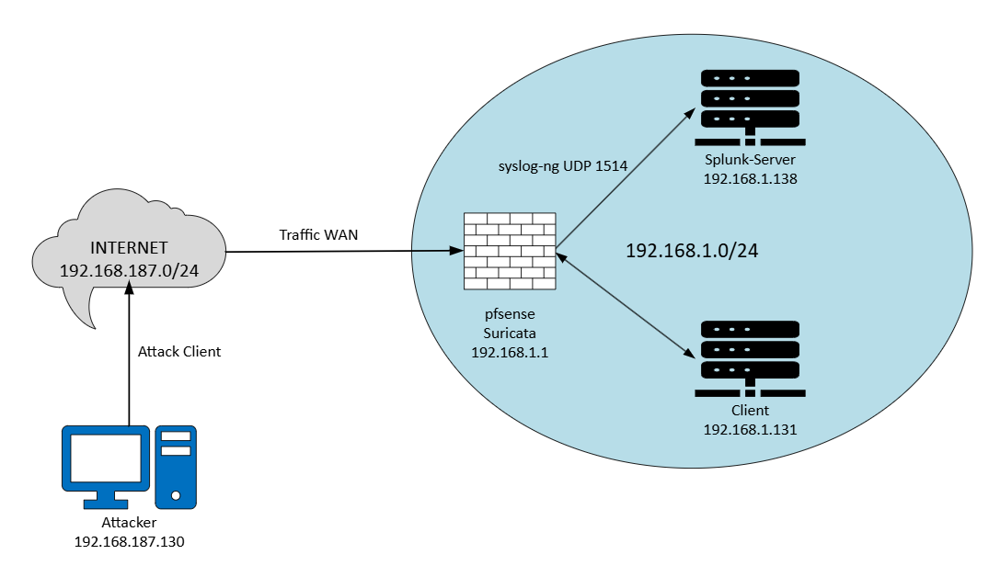

# 🛡️ pfSense-Suricata-Splunk Integration Lab

[](https://opensource.org/licenses/MIT)
[](https://github.com/klopkk74/pfSense-Suricata-Splunk-Integration-Lab/commits/main)
[](https://www.splunk.com/)
[](https://www.python.org/)

## 📌 Tổng quan

**pfSense-Suricata-Splunk Integration Lab** là một dự án xây dựng hệ thống giám sát an ninh mạng tập trung (SOC Lab - Security Operations Center Laboratory), mô phỏng môi trường vận hành bảo mật thực tế. Hệ thống tích hợp các công cụ mã nguồn mở và phần mềm miễn phí để phát hiện, thu thập, phân tích và cảnh báo các cuộc tấn công mạng.

### 🎯 Mục tiêu
- **Phát hiện tấn công mạng**: Sử dụng Suricata làm IDS/IPS để phát hiện các cuộc tấn công scan, DDoS, và malware.
- **Thu thập và phân tích log tập trung**: Sử dụng Splunk Enterprise để thu thập log từ pfSense và Suricata, phân tích và tạo cảnh báo.
- **Cảnh báo tự động**: Gửi cảnh báo qua Telegram để giám sát và ứng phó kịp thời.
- **Ứng phó sự cố**: Xây dựng quy trình phân tích, xác thực, ngăn chặn, và báo cáo sự cố.

### 🔧 Công nghệ sử dụng
| Công cụ | Phiên bản | Vai trò |
|---------|-----------|---------|
| [pfSense](https://www.pfsense.org/) | 2.7.2 | Tường lửa, gateway, chạy Suricata |
| [Suricata](https://suricata.io/) | 6.0.0 | IDS/IPS phát hiện tấn công mạng |
| [Splunk Enterprise](https://www.splunk.com/) | 9.3.1 | Thu thập, lưu trữ, phân tích log |
| [Syslog-ng](https://www.syslog-ng.com/) | 4.4 | Chuyển tiếp log từ pfSense đến Splunk |
| [Telegram Bot API](https://core.telegram.org/bots/api) | - | Gửi cảnh báo tự động |
| [Python](https://www.python.org/) | 3.10+ | Script gửi cảnh báo Telegram |
| [Kali Linux](https://www.kali.org/) | 2026.1 | Máy tấn công (nmap scan) |
| [Ubuntu Server](https://ubuntu.com/) | 22.04 LTS | Máy chủ mục tiêu |

---

## 🧱 Kiến trúc hệ thống

### Sơ đồ tổng quan



### Mô hình vật lý

| Thiết bị | Hostname | IP Address | Vai trò |
|----------|----------|------------|---------|
| **pfSense** | `pfsense` | `192.168.1.1` | Tường lửa, gateway, chạy Suricata (IDS/IPS) |
| **Suricata** | (trên pfSense) | `em0 (WAN)`, `em1 (LAN)` | IDS/IPS phát hiện tấn công scan |
| **Splunk Server** | `server` | `192.168.1.138` | Splunk Enterprise (Indexer & Search Head) |
| **Ubuntu Client** | `ubuntu-client` | `192.168.1.131` | Máy chủ mục tiêu |
| **Kali Linux** | `kali` | `192.168.187.130` | Máy tấn công (nmap scan) |

---

## 📂 Cấu trúc thư mục

```text
pfSense-Suricata-Splunk-Integration-Lab/
├── README.md
├── LICENSE
├── .gitignore
├── .env.example
├── docs/
│   ├── architecture.md
│   ├── setup-guide.md
│   ├── incident-response-playbook.md
│   └── troubleshooting.md
├── configs/
│   ├── pfsense/
│   │   └── syslog-ng.conf
│   ├── splunk/
│   │   ├── props.conf
│   │   ├── transforms.conf
│   │   ├── alert_actions.conf
│   │   └── scan_alert.spl
│   └── suricata/
│       └── enabled_rules.txt
├── scripts/
│   └── telegram_alert.py
├── diagrams/
│   ├── architecture.png
│   └── data-flow.png
├── images/
│   ├── kali-nmap-scan.png
│   ├── splunk-collect-log.png
│   ├── suricata-detect-attack.png
│   └── telegram-notice.png
└── lab-setup/
    └── vmware-settings.md
```

## 📚 Tài liệu
- [Hướng dẫn cài đặt](docs/setup-guide.md)
- [Quy trình ứng phó sự cố](docs/incident-response-playbook.md)
- [Xử lý sự cố](docs/troubleshooting.md)

## 👨‍💻 Tác giả
- Nguyễn Văn Khánh (https://github.com/klopkk74)

## 📄 Giấy phép
MIT License
