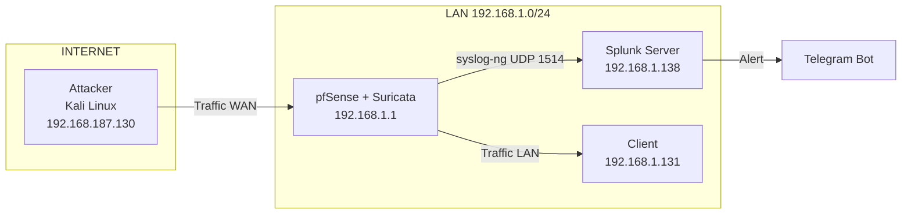

# Kiến trúc hệ thống

## Sơ đồ tổng quan

## Giải thích luồng dữ liệu

### Bước 1 — Attacker phát sinh traffic tấn công

- Attacker thực hiện tấn công vào hệ thống mạng LAN.
- Traffic tấn công đi từ mạng ngoài vào interface WAN của pfSense.
- Dữ liệu tại bước này là các gói tin thô, chưa được phân tích.
- Chưa có bất kỳ xử lý nào được thực hiện, đây là điểm khởi đầu của luồng dữ liệu.

---

### Bước 2 — Suricata phát hiện và sinh log

- Suricata nhận traffic trên interface WAN.
- Suricata đối chiếu gói tin với các rule đã bật.
- Khi phát hiện hành vi bất thường, Suricata sinh alert.
- Alert được ghi vào file log dưới định dạng JSON.
- Mỗi bản ghi log chứa các trường thông tin về sự kiện.
- Dữ liệu tại bước này là log JSON có cấu trúc, được ghi trên pfSense.

---

### Bước 3 — Syslog-ng chuyển tiếp log

- Syslog-ng đọc file log JSON theo thời gian thực.
- Mỗi bản ghi log được đóng gói thành một syslog message.
- Syslog message được gửi đến Splunk qua giao thức UDP.
- Đích đến là IP của Splunk Server.
- Dữ liệu tại bước này là log JSON được truyền qua mạng dưới dạng UDP.

---

### Bước 4 — Splunk nhận và parse log

- Splunk nhận log qua UDP Data Input.
- Log được gán sourcetype và index tương ứng.
- Quá trình parse JSON được thực hiện nhờ cấu hình props.conf và transforms.conf.
- Log được tách thành các trường riêng biệt.
- Dữ liệu tại bước này là log có cấu trúc, sẵn sàng cho truy vấn SPL.

---

### Bước 5 — Splunk tạo dữ liệu cảnh báo

- Các Alert trên Splunk chạy định kỳ theo lịch đã thiết lập.
- Alert lọc log theo các điều kiện đã cấu hình.
- Khi có kết quả truy vấn, Splunk tạo ra dữ liệu cảnh báo.
- Dữ liệu cảnh báo là tập kết quả SPL chứa thông tin về sự kiện tấn công.
- Dữ liệu tại bước này là kết quả truy vấn SPL.

---

### Bước 6 — Telegram Bot gửi cảnh báo đến người dùng

- Splunk gọi script telegram_alert.py.
- Script nhận kết quả SPL dưới dạng JSON.
- Script trích xuất các trường cần thiết từ kết quả.
- Script gửi HTTP request đến Telegram Bot API.
- Telegram Bot API gửi tin nhắn cảnh báo đến Chat ID đã cấu hình.
- Dữ liệu tại bước này là nội dung cảnh báo.
- Điểm cuối của luồng là người quản trị nhận được tin nhắn trên Telegram.

## Các thành phần chính

| Thành phần | Vai trò |
|------------|---------|
| pfSense | Tường lửa, gateway, chạy Suricata |
| Suricata | IDS/IPS phát hiện tấn công scan |
| Syslog-ng | Chuyển tiếp log từ pfSense đến Splunk |
| Splunk | Thu thập, lưu trữ, phân tích log |
| Telegram Bot | Gửi cảnh báo tự động |
